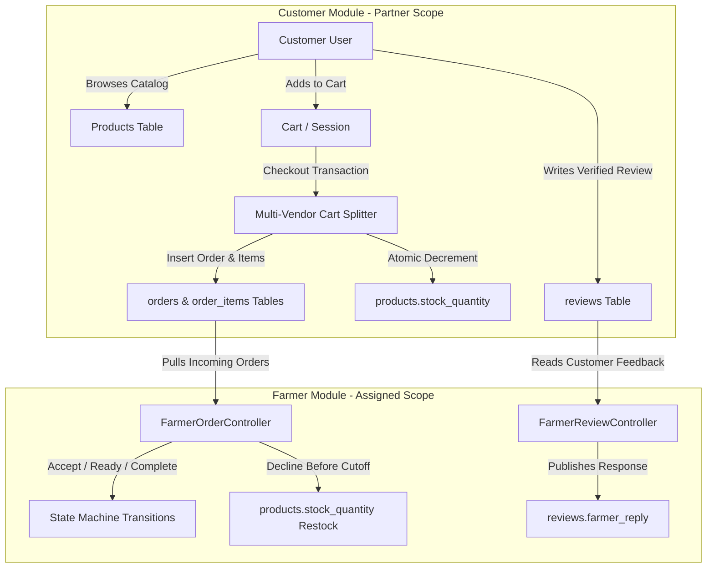
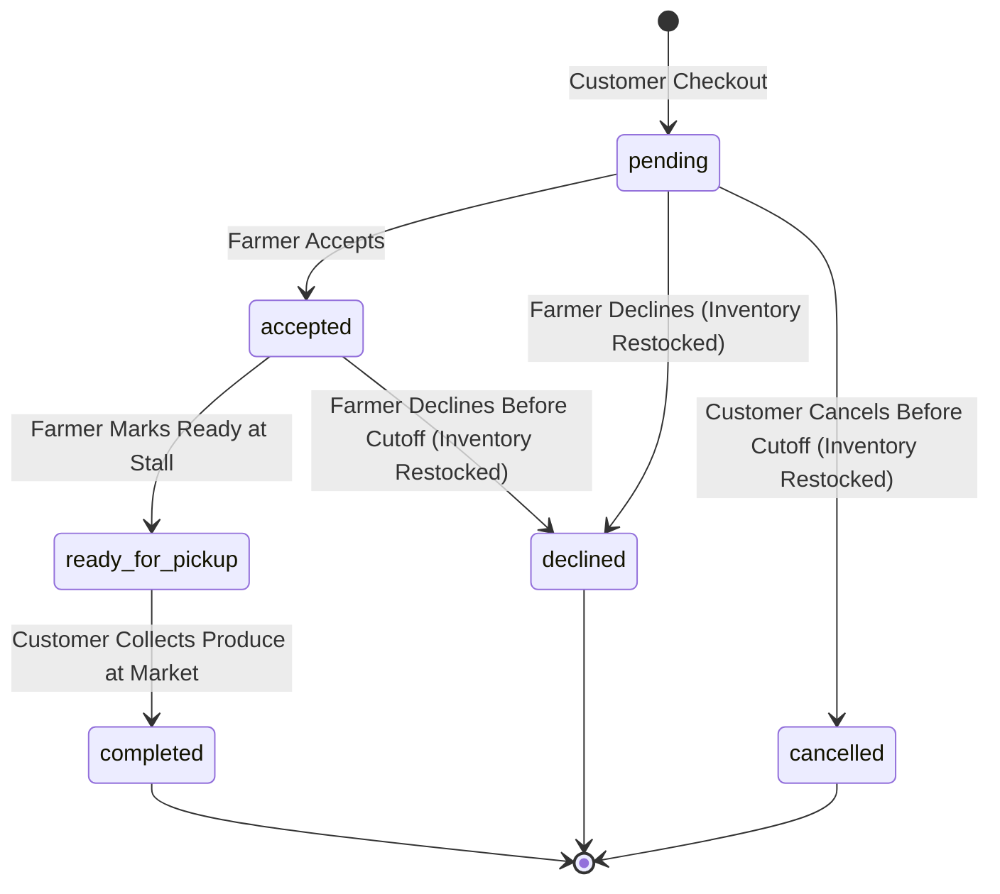

# MarketLink Backend API Integration & Schema Contract

**Target Audience:** Engineering Partner — Customer, Order, Cart, Favorites & Reviews Modules  
**Author:** Lead Systems Architect, MarketLink  
**Date:** September 2026  
**Version:** 1.0.0 (Production Blueprint)

---

## 1. Architectural Overview & Integration Boundaries

MarketLink is built on a direct-to-consumer (D2C) multi-vendor agricultural architecture connecting consumers directly to local certified farmers for weekend market pickups.

To achieve clear separation of concerns while maintaining strict referential integrity, the backend is split into two operational boundaries:
- **Boundary A (Farmer & Admin Modules):** Farmer onboarding, stall assignment, catalog & weekly quotas, incoming order fulfillment (`accept` -> `ready_for_pickup` -> `complete` / `decline`), review replies, platform content moderation, and reporting.
- **Boundary B (Customer & Marketplace Modules):** Customer authentication, marketplace discovery, shopping cart, favorites, order placement checkout, payment/pickup slot selection, and post-fulfillment product reviews.



---

## 2. Shared Database Tables & Strict 3NF Schemas

Both modules interact with four primary shared tables. All column names, data types, constraints, and defaults must match the specifications below.

### 2.1. `users` Table
Stores authentication credentials and roles for Admins, Farmers, and Customers.

| Column Name | SQL Type | Attributes / Constraints | Description |
| :--- | :--- | :--- | :--- |
| `id` | `BIGINT UNSIGNED` | `PRIMARY KEY`, `AUTO_INCREMENT` | Unique user identifier. |
| `name` | `VARCHAR(255)` | `NOT NULL` | Full display name. |
| `email` | `VARCHAR(255)` | `NOT NULL`, `UNIQUE INDEX` | Primary login email. |
| `email_verified_at` | `TIMESTAMP` | `NULLABLE` | Verification timestamp. |
| `password` | `VARCHAR(255)` | `NOT NULL` | Bcrypt or Argon2id hashed password string. |
| `role` | `ENUM('admin', 'farmer', 'customer')` | `NOT NULL`, `DEFAULT 'customer'` | System access role. Customer module must set `'customer'`. |
| `status` | `ENUM('pending', 'active', 'suspended')` | `NOT NULL`, `DEFAULT 'pending'` | Account access status. Customers are typically created with `'active'`. |
| `remember_token` | `VARCHAR(100)` | `NULLABLE` | Laravel remember me token. |
| `created_at` | `TIMESTAMP` | `NULLABLE` | Record creation timestamp. |
| `updated_at` | `TIMESTAMP` | `NULLABLE` | Record last update timestamp. |

*Composite Index:* `INDEX idx_users_role_status (role, status)`

---

### 2.2. `orders` Table
Stores the customer pre-orders placed for specific farmer market pickups.

| Column Name | SQL Type | Attributes / Constraints | Description |
| :--- | :--- | :--- | :--- |
| `id` | `BIGINT UNSIGNED` | `PRIMARY KEY`, `AUTO_INCREMENT` | Unique order identifier. |
| `customer_id` | `BIGINT UNSIGNED` | `NOT NULL`, `FOREIGN KEY (users.id) ON DELETE CASCADE` | ID of the customer placing the order. |
| `farmer_profile_id` | `BIGINT UNSIGNED` | `NOT NULL`, `FOREIGN KEY (farmer_profiles.id) ON DELETE CASCADE` | ID of the farmer profile fulfilling this order. |
| `market_id` | `BIGINT UNSIGNED` | `NULLABLE`, `FOREIGN KEY (markets.id) ON DELETE SET NULL` | Assigned market location for pickup (null for direct farm pickup). |
| `total_amount` | `DECIMAL(10,2)` | `NOT NULL` | Order gross total sum. Must equal sum of `order_items.subtotal`. |
| `status` | `ENUM('pending', 'accepted', 'declined', 'ready_for_pickup', 'completed', 'cancelled')` | `NOT NULL`, `DEFAULT 'pending'` | Current order fulfillment state. |
| `pickup_slot` | `VARCHAR(255)` | `NOT NULL` | Selected time window (e.g., `"09:00 AM - 10:00 AM"`). |
| `decline_reason` | `TEXT` | `NULLABLE` | Stored reason populated by farmer upon declining. |
| `cutoff_time` | `TIMESTAMP` | `NULLABLE` | Order modification cutoff deadline (calculated at checkout). |
| `created_at` | `TIMESTAMP` | `NULLABLE` | Order timestamp. |
| `updated_at` | `TIMESTAMP` | `NULLABLE` | Timestamp of last status change. |

*Indexes:*
- `INDEX idx_orders_farmer_status (farmer_profile_id, status)`
- `INDEX idx_orders_customer_status (customer_id, status)`
- `INDEX idx_orders_farmer_slot (farmer_profile_id, pickup_slot)`

> [!IMPORTANT]
> The computed attribute `order_number` (formatted as `ORD-0001`) is dynamically resolved via the Eloquent accessor `ORD-` + `str_pad(id, 4, '0', STR_PAD_LEFT)`. Do not attempt to insert an `order_number` column into the database directly.

---

### 2.3. `order_items` Table
Stores line items associated with each order.

| Column Name | SQL Type | Attributes / Constraints | Description |
| :--- | :--- | :--- | :--- |
| `id` | `BIGINT UNSIGNED` | `PRIMARY KEY`, `AUTO_INCREMENT` | Unique line item identifier. |
| `order_id` | `BIGINT UNSIGNED` | `NOT NULL`, `FOREIGN KEY (orders.id) ON DELETE CASCADE` | Parent order reference. |
| `product_id` | `BIGINT UNSIGNED` | `NOT NULL`, `FOREIGN KEY (products.id) ON DELETE RESTRICT` | Product purchased. Restricted to maintain transaction history. |
| `quantity` | `INT` | `NOT NULL` | Quantity purchased (in product's unit). |
| `unit_price` | `DECIMAL(10,2)` | `NOT NULL` | Historical snapshot price per unit at moment of checkout. |
| `subtotal` | `DECIMAL(10,2)` | `NOT NULL` | Calculated as `quantity * unit_price`. |
| `created_at` | `TIMESTAMP` | `NULLABLE` | Line item timestamp. |
| `updated_at` | `TIMESTAMP` | `NULLABLE` | Line item update timestamp. |

*Index:* `INDEX idx_order_items_order_product (order_id, product_id)`

---

### 2.4. `reviews` Table
Stores post-fulfillment customer ratings and farmer replies.

| Column Name | SQL Type | Attributes / Constraints | Description |
| :--- | :--- | :--- | :--- |
| `id` | `BIGINT UNSIGNED` | `PRIMARY KEY`, `AUTO_INCREMENT` | Unique review identifier. |
| `order_id` | `BIGINT UNSIGNED` | `NOT NULL`, `FOREIGN KEY (orders.id) ON DELETE CASCADE` | Verified purchase order reference. |
| `customer_id` | `BIGINT UNSIGNED` | `NOT NULL`, `FOREIGN KEY (users.id) ON DELETE CASCADE` | ID of customer writing the review. |
| `farmer_profile_id` | `BIGINT UNSIGNED` | `NOT NULL`, `FOREIGN KEY (farmer_profiles.id) ON DELETE CASCADE` | Targeted farmer profile. |
| `product_id` | `BIGINT UNSIGNED` | `NULLABLE`, `FOREIGN KEY (products.id) ON DELETE SET NULL` | Optional specific product referenced. |
| `rating` | `TINYINT UNSIGNED` | `NOT NULL` | Star rating integer between `1` and `5`. |
| `comment` | `TEXT` | `NOT NULL` | Customer review text. |
| `farmer_reply` | `TEXT` | `NULLABLE` | Response string provided by the farmer. |
| `is_moderated` | `BOOLEAN` | `NOT NULL`, `DEFAULT FALSE` | True if flagged/hidden by administrator moderation. |
| `created_at` | `TIMESTAMP` | `NULLABLE` | Submission timestamp. |
| `updated_at` | `TIMESTAMP` | `NULLABLE` | Last modification timestamp. |

*Indexes:*
- `INDEX idx_reviews_farmer_moderated (farmer_profile_id, is_moderated)`
- `INDEX idx_reviews_customer_order (customer_id, order_id)`
- `INDEX idx_reviews_product (product_id)`

---

## 3. Order Lifecycle State Machine & Transition Rules

The order state machine ensures that neither farmers nor customers can transition orders into invalid or contradictory states.



### Transition Authority Matrix

| Origin State | Target State | Permitted Initiator | Guard Preconditions | Triggered Side Effects |
| :--- | :--- | :--- | :--- | :--- |
| **`[*]`** | `pending` | **Customer** | Stock is available (`stock_quantity >= qty`). | Inventory decremented; `cutoff_time` set. |
| **`pending`** | `accepted` | **Farmer** | Current timestamp is before `cutoff_time`. | Notifies customer of order confirmation. |
| **`pending`** | `declined` | **Farmer** | Mandatory `decline_reason` string provided. | **Automatic stock restock** in `products`. |
| **`pending`** | `cancelled` | **Customer** | Current timestamp is before `cutoff_time`. | **Automatic stock restock** in `products`. |
| **`accepted`** | `ready_for_pickup` | **Farmer** | Order is in `accepted` state; morning of pickup. | Customer receives pickup notification with stall #. |
| **`accepted`** | `declined` | **Farmer** | Emergency cancellation before `cutoff_time`. | **Automatic stock restock** in `products`. |
| **`ready_for_pickup`** | `completed` | **Farmer** | Customer arrives, verifies order, receives goods. | Unlocks Customer ability to write a review. |

### Cutoff Time Enforcement
Each order defines a `cutoff_time` timestamp (e.g., 6 hours or 12 hours before the start of the `pickup_slot`).
- Once `now() > order->cutoff_time`, the Farmer Controller rejects decline operations with an HTTP `422 Unprocessable Entity`:
  ```json
  {
    "status": "error",
    "message": "The cutoff time for this order has passed. Status cannot be modified."
  }
  ```
- Customers cannot cancel an order once the cutoff deadline has elapsed.

---

## 4. Inter-Module Expectations & Checkout Logic

### 4.1. Multi-Vendor Order Splitting
Customers can add products from multiple farms into a single shopping cart. However, an order represents an agreement between **one customer and one specific farmer**.

> [!CRITICAL]
> **Cart Checkout Splitting Rule:**  
> During checkout, your checkout service **must group cart items by `product.farmer_profile_id`** and insert **one distinct `orders` record per farmer**, each containing its corresponding `order_items`. Never insert an order that references items from multiple farmers.

### 4.2. Atomic Inventory Reservation
To prevent overselling of limited agricultural stock, inventory deduction **must happen atomically** at the point of order creation.

#### Reference Implementation for Checkout Service:

```php
use App\Models\Order;
use App\Models\OrderItem;
use App\Models\Product;
use Illuminate\Support\Facades\DB;
use Exception;

public function processCheckout(int $customerId, int $marketId, string $pickupSlot, array $cartItems)
{
    // 1. Group cart items by farmer_profile_id
    $groupedByFarmer = collect($cartItems)->groupBy('farmer_profile_id');

    return DB::transaction(function () use ($customerId, $marketId, $pickupSlot, $groupedByFarmer) {
        $createdOrders = [];

        foreach ($groupedByFarmer as $farmerProfileId => $items) {
            $orderTotal = 0;
            $orderLines = [];

            foreach ($items as $item) {
                // Lock row to prevent race conditions during checkout
                $product = Product::where('id', $item['product_id'])
                    ->lockForUpdate()
                    ->firstOrFail();

                if ($product->stock_quantity < $item['quantity']) {
                    throw new Exception("Insufficient stock for {$product->name}. Remaining: {$product->stock_quantity}");
                }

                // Deduct stock quantity
                $product->decrement('stock_quantity', $item['quantity']);

                // If stock reaches 0, toggle availability
                if ($product->fresh()->stock_quantity <= 0) {
                    $product->update(['is_available' => false]);
                }

                $subtotal = round($product->price * $item['quantity'], 2);
                $orderTotal += $subtotal;

                $orderLines[] = [
                    'product_id' => $product->id,
                    'quantity'   => $item['quantity'],
                    'unit_price' => $product->price,
                    'subtotal'   => $subtotal,
                ];
            }

            // Calculate cutoff time (e.g., 6 hours before pickup window)
            $cutoffTime = now()->addHours(12);

            // Create Order
            $order = Order::create([
                'customer_id'       => $customerId,
                'farmer_profile_id' => $farmerProfileId,
                'market_id'         => $marketId,
                'total_amount'      => $orderTotal,
                'status'            => 'pending',
                'pickup_slot'       => $pickupSlot,
                'cutoff_time'       => $cutoffTime,
            ]);

            // Create Order Items
            foreach ($orderLines as $line) {
                $line['order_id'] = $order->id;
                OrderItem::create($line);
            }

            $createdOrders[] = $order;
        }

        return $createdOrders;
    });
}
```

---

## 5. Review System Schema Mapping & Feedback Loop

### 5.1. Verified Purchase Rule
A customer can only submit a review for an order that satisfies:
1. `order.customer_id === auth()->id()`
2. `order.status === 'completed'`
3. A review does not already exist for `order.id` (1-to-1 relationship between order and review).

### 5.2. Review Insertion Payload
When your module saves a customer review, it must populate:
- `order_id`: The ID of the completed order.
- `customer_id`: `auth()->id()`.
- `farmer_profile_id`: Must match the order's `order.farmer_profile_id`.
- `product_id`: `nullable` — Set to the primary `product_id` if the review is item-specific.
- `rating`: Integer from `1` to `5`.
- `comment`: Customer review text (min 5, max 1000 characters).
- `farmer_reply`: Default `null` (only editable by the farmer via `POST /api/v1/farmer/reviews/{id}/reply`).
- `is_moderated`: Default `false`.

---

## 6. Base URL, Authentication, & Error Handling Conventions

### 6.1. Route Prefixing & Base URLs
All API endpoints follow semantic versioning under `/api/v1/`:
- Customer endpoints: `/api/v1/customer/...`
- Public catalog endpoints: `/api/v1/markets`, `/api/v1/categories`, `/api/v1/announcements`
- Farmer endpoints: `/api/v1/farmer/...`
- Admin endpoints: `/api/v1/admin/...`

### 6.2. Authentication Header
MarketLink utilizes **Laravel Sanctum** token-based authentication. Pass the bearer token in every secured request:
```http
Authorization: Bearer <sanctum_personal_access_token>
Accept: application/json
Content-Type: application/json
```

### 6.3. Standardized Error Response Formats

All API responses must maintain predictable JSON schemas across both modules.

#### 1. Validation Error (`422 Unprocessable Entity`)
```json
{
  "status": "error",
  "message": "Validation errors occurred.",
  "errors": {
    "pickup_slot": [
      "The pickup_slot field is required."
    ],
    "items.0.quantity": [
      "The quantity must be at least 1."
    ]
  }
}
```

#### 2. Unauthenticated (`401 Unauthorized`)
```json
{
  "message": "Unauthenticated."
}
```

#### 3. Forbidden Role / Suspended User (`403 Forbidden`)
```json
{
  "status": "error",
  "message": "Unauthorized. Customer account is suspended or lacks required permissions."
}
```

#### 4. Resource Not Found (`404 Not Found`)
```json
{
  "status": "error",
  "message": "Order not found."
}
```

#### 5. Standard Success Response (`200 OK` / `201 Created`)
```json
{
  "status": "success",
  "message": "Operation completed successfully.",
  "data": { ... }
}
```

---

## 7. Integration Verification Checklist

Before running joint integration tests with the Farmer and Admin modules, confirm that your module meets the following criteria:

- [ ] **Customer user records** in `users` are saved with `role = 'customer'` and `status = 'active'`.
- [ ] **Multi-vendor cart items** are correctly segregated into multiple `orders` records, each strictly linked to a single `farmer_profile_id`.
- [ ] **Atomic stock reduction** occurs inside a database transaction during checkout with row-level locks (`lockForUpdate()`).
- [ ] **Orders table insertions** do not attempt to write to non-existent columns (`order_number` is an accessor, not a DB column).
- [ ] **Line items** correctly snapshot the `unit_price` at moment of purchase in `order_items`.
- [ ] **`cutoff_time`** is populated upon order creation to allow farmer order state machine enforcement.
- [ ] **Reviews** can only be created against orders with `status = 'completed'` and correctly map `farmer_profile_id`.
- [ ] Requests supply the `Accept: application/json` header and conform to the standardized error schema.
