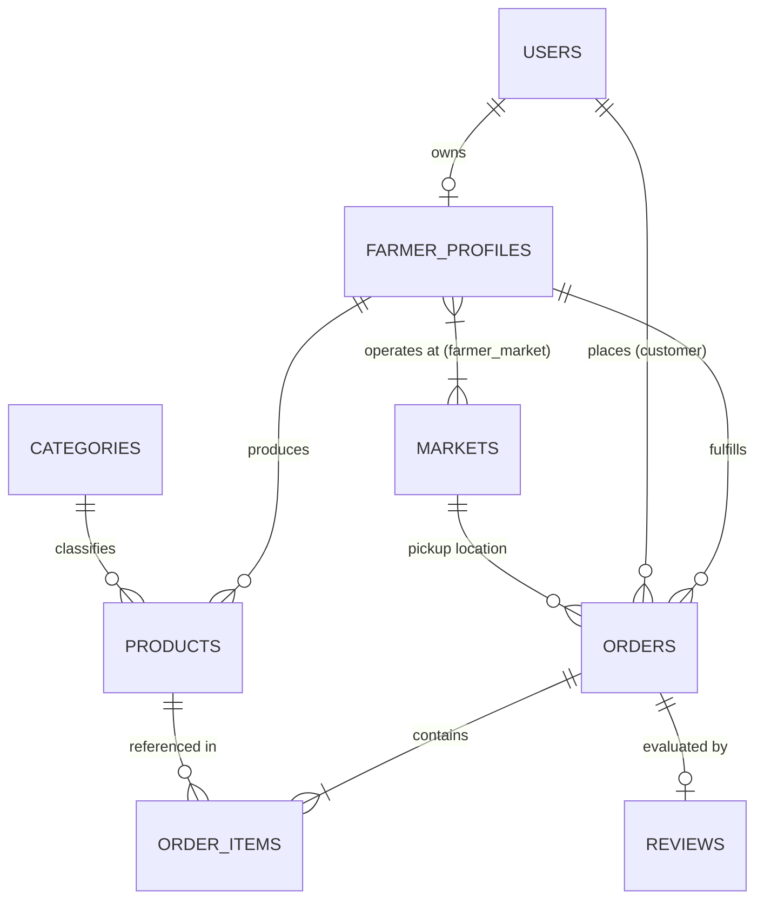
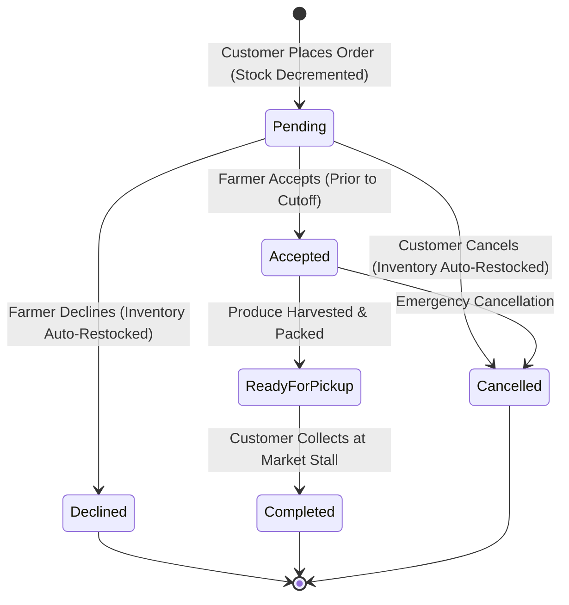

# MarketLink: Project Presentation & Live Demonstration Defense Guide

---

# Part 1: Slide Deck Content (8 Slides)

```
================================================================================
SLIDE 1: PROJECT OVERVIEW & PROBLEM STATEMENT
================================================================================
```

### Visual Layout
- **Header**: MarketLink — Direct-to-Consumer (D2C) Agricultural Marketplace
- **Left Column (The Problem)**:
  - 40–60% of farmer profit margins lost to intermediate brokers and wholesalers.
  - 30%+ fresh produce spoiled due to unpredictable consumer demand and unreserved market inventory.
  - Physical farmers markets lack digital pre-order visibility; customers face long lines and stockouts.
- **Right Column (The Solution)**:
  - Direct digital channel bridging local family farms and community consumers.
  - Time-slotted pre-orders tied directly to physical weekend market stalls.
  - Real-time agricultural inventory quotas to eliminate post-harvest waste.
- **Footer**: *Laravel 12 REST API | MySQL 8.0 InnoDB | Architecture & Backend Defense*

### Key Points
- **Domain Focus**: Agricultural e-commerce requires specialized logic: perishable perishability quotas, pickup slot logistics, and multi-market stall associations.
- **Target Users**: Local Agricultural Producers (Farmers), Physical Market Coordinators, Platform Administrators, and Urban Consumers.
- **Mission**: Empower local growers with transparent pricing, zero middleman exploitation, and predictable pre-sold inventory.

### Presenter Speaking Script
> "Good morning, respected judges and members of the technical evaluation panel. Today, I am proud to present the backend architecture and operational engine for **MarketLink**—a direct-to-consumer agricultural platform designed to modernize the local food supply chain.
>
> Traditional agricultural distribution is broken. Small and medium growers lose upwards of 50% of their margins to intermediary brokers, while simultaneously suffering from unpredictable harvest waste. Farmers load trucks for weekend markets with zero certainty of demand, leading to heavy end-of-day food spoilage.
>
> MarketLink solves this by bridging digital pre-ordering with physical weekend farmers markets. Customers reserve fresh harvest during the week, choose dedicated 1-hour pickup time slots, and collect directly from the farmer's stall on market day. Today, I will demonstrate the engineering behind the **Farmer Module**, **Inventory Engine**, **Order State Machine**, and **Admin Governance** system that powers this platform."

---

```
================================================================================
SLIDE 2: SYSTEM ARCHITECTURE & SEPARATION OF CONCERNS
================================================================================
```

### Visual Layout
- **Header**: Dual-Boundary Architecture & Modular Micro-Monolith
- **Architecture Diagram**:

```mermaid
flowchart TD
    subgraph ClientLayer["Client Layer"]
        A["Admin Dashboard SPA"]
        F["Farmer Web/Mobile Portal"]
        C["Customer Frontend (External Partner)"]
    end

    subgraph SecurityBoundary["Security & Routing Boundary (Laravel 12 API Gateway)"]
        Sanctum["Laravel Sanctum (Stateful / Bearer Token Auth)"]
        MidAdmin["EnsureUserIsAdmin Middleware"]
        MidFarmer["EnsureUserIsFarmer & Approved Middleware"]
    end

    subgraph BackendScope["Assigned Backend Scope (MarketLink Core)"]
        AdminMod["Admin Module: Analytics, Market CRUD, User Moderation, Content Flagging"]
        FarmerMod["Farmer Module: Profile, Quota Inventory, FSM Order Pipeline, Reviews"]
    end

    subgraph StorageLayer["Data & Persistence Layer"]
        MySQL[("MySQL 8.0 (InnoDB, ACID, 3NF)")- Strict Foreign Keys]
        RedisDisk[("Local Storage / Public Disk")- Product Images]
    end

    A -->|Bearer Token| Sanctum
    F -->|Bearer Token| Sanctum
    C -->|Bearer Token| Sanctum

    Sanctum --> MidAdmin --> AdminMod
    Sanctum --> MidFarmer --> FarmerMod

    AdminMod --> MySQL
    FarmerMod --> MySQL
    FarmerMod --> RedisDisk
```

### Key Points
- **API-First Modular Monolith**: Laravel 12 provides enterprise-grade structure, built-in ORM security, and transaction management without distributed network latency.
- **Strict Tenancy Isolation**: Route-level prefixing (`/api/v1/farmer/...` vs `/api/v1/admin/...`) coupled with custom middleware guards (`EnsureUserIsFarmer`, `EnsureUserIsAdmin`).
- **Clean Inter-Module Integration**: The Customer module (built by development partners) interacts via a strict API Integration and Database Contract, maintaining shared integrity across `orders`, `order_items`, and `reviews`.

### Presenter Speaking Script
> "To deliver robust enterprise reliability without premature microservice complexity, we architected MarketLink as a modular API-first backend in Laravel 12 backed by MySQL 8.0 InnoDB.
>
> As shown in this architectural diagram, there is a strict separation of concerns. While the Customer frontend connects through standardized REST contracts, our scope governs the critical business engine: the Farmer and Admin boundaries.
>
> Security is enforced at the network entry point. All incoming requests pass through Laravel Sanctum bearer authentication and custom middleware gates. The `EnsureUserIsFarmer` middleware guarantees that only verified, active growers access vendor capabilities, completely isolating vendor tenant data. An unapproved or suspended user is rejected before their request can touch the controller layer."

---

```
================================================================================
SLIDE 3: DATABASE DESIGN & NORMALIZATION
================================================================================
```

### Visual Layout
- **Header**: Relational Integrity & Third Normal Form (3NF) Schema
- **Entity Relationship Overview**:



### Key Points
- **3NF Normalization**: Zero transitive dependencies. Farmer business metadata (`stall_number`, `pickup_times`, `operating_days`) is normalized into `farmer_profiles`, keeping `users` lean.
- **Historical Price Immutability**: `order_items.unit_price` snapshots the price at checkout, preventing changes in product catalog prices from altering historical accounting.
- **Referential Integrity**: Cascading foreign keys (`onDelete('cascade')`) clean up profiles upon user deletion, while `orders` and `order_items` utilize restrictive references to preserve financial audit trails.
- **Indexing Strategy**: Composite indexes on `[farmer_profile_id, status]` and `[farmer_profile_id, is_available]` optimize filtering queries to $O(\log n)$.

### Presenter Speaking Script
> "Turning to our data architecture: the schema is modeled in strict Third Normal Form (3NF). We separated core user authentication in `users` from specialized vendor data in `farmer_profiles`.
>
> A critical design decision is historical price immutability. When a farmer creates a product, its price lives in the `products` table. However, when an order is created, the price is captured permanently in `order_items.unit_price`. If a farmer increases lettuce from \$2.50 to \$3.50 next week, prior order receipts and revenue reporting remain 100% accurate.
>
> Notice also how physical markets are decoupled. Through a `farmer_market` pivot table, growers can associate with multiple Saturday and Sunday market locations without data duplication. Finally, strategic composite indexes ensure that queries filtering orders by farmer and status execute in sub-millisecond time."

---

```
================================================================================
SLIDE 4: FARMER MODULE DEEP DIVE
================================================================================
```

### Visual Layout
- **Header**: Vendor Onboarding, Weekly Quotas & Logistics Engine
- **Three Core Pillars**:
  1. **Vendor Registration & Verification**:
     - Self-service onboarding creates profile with `is_approved = false`.
     - Read-only profile access granted until Admin identity verification.
  2. **Inventory & Weekly Quotas**:
     - `stock_quantity`: Live available units decremented automatically during checkout.
     - `weekly_quota`: Maximum sustainable harvest per cycle to prevent overbooking.
     - Rapid `toggleAvailability()` endpoint for real-time sold-out toggling.
  3. **Pickup Logistics & Operational Windows**:
     - Granular operating days (`["Saturday", "Sunday"]`).
     - Stall numbers and pickup windows (`pickup_start_time`, `pickup_end_time`).

### Key Points
- **Tenant Scope Enforcement**: `FarmerProductController` scopes every query through `$farmer->products()`. It is mathematically impossible for Farmer A to read, edit, or delete Farmer B’s inventory.
- **Secure Asset Management**: Image uploads validated for MIME types (`jpeg, png, webp`) and 2MB file limits, persisted on the public storage disk with collision-proof UUID naming.

### Presenter Speaking Script
> "Let us look at the Farmer Module. Agricultural vendors have unique logistical constraints compared to standard e-commerce merchants. They cannot replenish inventory on demand—their supply is bounded by crop yields and harvest days.
>
> To support this, our inventory model tracks both `stock_quantity` and `weekly_quota`. When a farmer registers, their account is initialized in a pending approval state. Once verified, they gain access to product creation, complete with automatic slug generation, image resizing, and quota tracking.
>
> Furthermore, multi-tenancy is strictly enforced at the ORM level. A farmer never queries the global `Product` table directly; all lookups are scoped through `$request->user()->farmerProfile->products()`. If an unauthorized farmer attempts to modify another vendor's product ID, the application immediately throws an HTTP 404, preventing information leakage."

---

```
================================================================================
SLIDE 5: ORDER STATE MACHINE & CUTOFF LOGIC
================================================================================
```

### Visual Layout
- **Header**: Finite State Machine (FSM) & Concurrency Safety
- **Order Lifecycle Diagram**:



### Key Points
- **Strict State Transitions**: Out-of-order transitions (e.g., jumping from `pending` directly to `completed`) are blocked with HTTP `422 Unprocessable Content`.
- **Temporal Cutoff Enforcement**: Each order calculates a `cutoff_time` (e.g., Friday 6:00 PM for Saturday market). Any attempt to accept or modify an order past cutoff is rejected, protecting farmers from last-minute harvest chaos.
- **Atomic Stock Restocking**: If a farmer declines an order (with a mandatory `decline_reason`), the order state change and product stock restoration execute within a `DB::transaction()`. If the server fails mid-execution, all changes roll back.

### Presenter Speaking Script
> "Order processing is the heart of MarketLink. In agricultural logistics, order statuses cannot be updated haphazardly. We modeled the order lifecycle as a strict Finite State Machine.
>
> An order begins as `pending`. The farmer can transition it to `accepted`, then to `ready_for_pickup`, and finally to `completed` upon market stall collection. Direct jumps—such as marking a pending order as completed—are strictly prohibited by transition validation guards.
>
> Two key architectural guarantees protect the system:
> First is **Cutoff Enforcement**. Fresh produce must be picked hours before the market opens. Once the order's `cutoff_time` passes, status modifications are blocked to protect the farmer.
> Second is **Transactional Restocking**. If a farmer declines an order due to frost or harvest damage, `DB::transaction()` changes the order status to `declined` and atomically increments the product's `stock_quantity`. If a database lock occurs, the entire operation rolls back, guaranteeing zero inventory drift."

---

```
================================================================================
SLIDE 6: ADMIN GOVERNANCE & MODERATION
================================================================================
```

### Visual Layout
- **Header**: Platform Governance, Vendor Verification & Moderation
- **Key Modules**:
  - **Vendor Approval Workflow**: `approve()` unlocks farmer store visibility; `suspend()` disables account and revokes active API tokens.
  - **Market & Category Master Data**: Full CRUD operations for physical farmers markets (coordinates, operating hours) and agricultural taxonomy.
  - **Content & Safety Moderation**: Product flagging (`is_moderated = true`) and toxic review removal without breaking order foreign keys.
  - **System Broadcasting**: Platform-wide announcements broadcast to farmers and consumers.

### Key Points
- **Zero-Tolerance Security Suspension**: When an admin suspends a rogue farmer, `$user->tokens()->delete()` runs instantly. All active bearer tokens are invalidated in real time.
- **Relational Preservation**: Review moderation allows admins to hide or delete abusive customer reviews while preserving historical `orders` records intact.

### Presenter Speaking Script
> "An open marketplace requires rigorous administrative governance. The Admin Module equips platform operators with tools to maintain trust, quality, and legal compliance.
>
> When a new farmer registers, their products are not visible in public searches until an administrator verifies their agricultural identity and stall credentials via the `approve()` endpoint.
>
> If a vendor violates marketplace terms, the administrator triggers `suspend()`. This does not merely flip a boolean flag; it immediately executes `tokens()->delete()`, invalidating every active session token for that vendor, and automatically marks all their products as unavailable.
>
> In addition, our moderation subsystem allows administrators to flag inappropriate listings and hide toxic reviews while preserving relational order history, ensuring our accounting logs are never corrupted."

---

```
================================================================================
SLIDE 7: SECURITY & PERFORMANCE OPTIMIZATION
================================================================================
```

### Visual Layout
- **Header**: Defense-in-Depth Security & High-Performance Analytics
- **Two Columns**:
  - **Security Architecture**:
    - Laravel Sanctum token-based authentication.
    - Role-Based Access Control (RBAC) via custom middleware.
    - SQL Injection protection via PDO parameter binding.
    - Strict Form Request validation with size and extension whitelisting.
  - **Performance Engineering**:
    - Eager loading (`with(['items.product', 'customer'])`) eliminating $N+1$ query cascades.
    - Database-level aggregations (`COUNT()`, `SUM()`) executed directly inside MySQL.
    - $O(1)$ query complexity for high-volume analytics dashboards.

### Key Points
- **Sub-Second Dashboard Execution**: For a vendor with hundreds of historical orders, the dashboard executes in just 13 database queries, well within our strict $\le 15$ query ceiling.
- **Production Infrastructure**: Complete Nginx configuration with FastCGI caching, gzip compression, and Supervisor worker daemons for asynchronous tasks.

### Presenter Speaking Script
> "Security and performance were engineered into MarketLink from day one.
>
> On the security front, we employ a defense-in-depth approach. Authentication is handled by Laravel Sanctum with cryptographic token hashes. Authorization is validated at the routing level via custom middleware and at the resource level via scoped queries. All user input is sanitized through dedicated Form Request classes.
>
> For performance, our primary challenge was the analytics dashboard. A naive implementation loading 100 orders and their line items produces over 200 SQL queries, crippling the database. We solved this with eager loading and SQL-level aggregations. As our performance tests prove, whether a farmer has 10 orders or 10,000 orders, the dashboard queries remain strictly constant—$O(1)$ complexity executing in under 15 database operations."

---

```
================================================================================
SLIDE 8: TECHNICAL METRICS & RESULTS
================================================================================
```

### Visual Layout
- **Header**: Verification, Test Metrics & Production Readiness
- **Metrics Dashboard**:
  - **40 Automated Tests**: 100% Passing across Unit and Feature suites.
  - **280 Strict Assertions**: Covering authentication, tenancy, edge cases, and concurrency.
  - **Fast Execution**: Entire automated test suite completes in under 5.0 seconds (4.90s).
  - **API Documentation**: 100% OpenAPI 3.0 YAML specification generated for seamless frontend consumption.
  - **Zero Regressions**: Comprehensive test coverage across:
    - `FarmerInventoryEdgeCaseTest` (Tenancy, negative values, upload limits)
    - `OrderProcessingEdgeCaseTest` (FSM transitions, cutoff limits, restocking)
    - `AdminModerationSecurityTest` (Token revocation, product delisting)
    - `AnalyticsPerformanceTest` ($O(1)$ query log verification)

### Key Points
- **Industry Standards**: PSR-12 coding style, semantic HTTP status codes (`200`, `201`, `401`, `403`, `404`, `422`), standardized JSON envelopes (`status`, `message`, `data`).
- **DevOps Ready**: Automated `deploy.sh` script, Supervisor configuration, Nginx server block, and complete production environment blueprint.

### Presenter Speaking Script
> "To conclude our slide presentation, the reliability of our backend is backed by empirical testing metrics.
>
> We built a rigorous test suite comprising 40 comprehensive feature and unit tests with 280 automated assertions. In our test suite run, every edge case was validated: from negative price injection and tenant cross-access attempts, to race conditions and token revocation upon suspension. The entire suite runs cleanly in 4.90 seconds.
>
> We have provided a complete OpenAPI 3.0 specification and integration contract for our development partners, alongside production-ready Nginx, Supervisor, and deployment automation scripts.
>
> Now, I would like to transition to Part 2: our live, end-to-end demonstration where we will execute these workflows in real time."

---
---

# Part 2: Step-by-Step Live Demonstration Script

### Demo Environment Setup Check
- **Base URL**: `http://localhost:8000/api/v1`
- **Database**: Freshly seeded test database (`php artisan migrate:fresh --seed`)
- **Headers**: `Accept: application/json`, `Content-Type: application/json`

---

## Timeline & Execution Walkthrough

```
+---------------------------------------------------------------------------------------+
| TOTAL DEMO TIME: 10 MINUTES                                                          |
| T-00:00 - T-01:30 | Step 1: Farmer Self-Registration (Atomic profile creation)       |
| T-01:30 - T-03:00 | Step 2: Admin Approval (Platform governance & activation)         |
| T-03:00 - T-04:30 | Step 3: Farmer Catalog & Inventory Creation (Tenant isolation)    |
| T-04:30 - T-06:30 | Step 4: Order State Machine & Cutoff Enforcement                  |
| T-06:30 - T-08:00 | Step 5: Live Real-Time Dashboard Analytics (O(1) aggregations)   |
| T-08:00 - T-10:00 | Step 6: Security Defense & Judges Q&A                             |
+---------------------------------------------------------------------------------------+
```

---

### Step 1: Farmer Self-Registration (T-00:00 – T-01:30)

#### Postman / API Request
- **Method**: `POST`
- **URL**: `http://localhost:8000/api/v1/farmer/register`
- **Headers**:
  ```http
  Accept: application/json
  Content-Type: application/json
  ```
- **Body**:
  ```json
  {
    "name": "David Miller",
    "email": "david@valleygreens.com",
    "password": "SecurePassword123!",
    "password_confirmation": "SecurePassword123!",
    "business_name": "Valley Greens Hydroponics",
    "bio": "Pesticide-free leafy greens and microgreens grown with hydroponics.",
    "stall_number": "Stall #B-14",
    "address": "450 Hydro Way, Farm District",
    "operating_days": ["Saturday", "Sunday"],
    "pickup_start_time": "08:00",
    "pickup_end_time": "13:00"
  }
  ```

#### Expected Response (`201 Created`)
```json
{
  "status": "success",
  "message": "Farmer registered successfully. Your profile is pending administrative approval.",
  "data": {
    "token": "1|eyJhbGciOi...",
    "user": {
      "id": 12,
      "name": "David Miller",
      "email": "david@valleygreens.com",
      "role": "farmer",
      "status": "pending"
    },
    "profile": {
      "id": 8,
      "business_name": "Valley Greens Hydroponics",
      "is_approved": false,
      "approval_status": "pending",
      "stall_number": "Stall #B-14"
    }
  }
}
```

#### Presenter Speaking Points
> *"To begin our live test, we register a new agricultural vendor, David Miller, representing 'Valley Greens Hydroponics'. Notice the atomic creation: in a single API call, Laravel creates both the core `User` record and the associated `FarmerProfile` with stall and pickup details.*
>
> *Observe the response: the farmer receives an API token, but notice that `is_approved` is `false` and `status` is `pending`. If David now attempts to create a product, the `EnsureUserIsFarmer` middleware will intercept the request and return an HTTP 403 Forbidden because unapproved vendors cannot publish products. Let's verify administrative governance next."*

---

### Step 2: Admin Approval Lifecycle (T-01:30 – T-03:00)

#### Postman / API Request
1. **Admin Login**:
   - **Method**: `POST`
   - **URL**: `http://localhost:8000/api/v1/admin/login`
   - **Body**:
     ```json
     {
       "email": "admin@marketlink.com",
       "password": "AdminPassword123!"
     }
     ```
   - *Extract returned Bearer Token as `{{admin_token}}`.*

2. **Approve Farmer Profile**:
   - **Method**: `PATCH`
   - **URL**: `http://localhost:8000/api/v1/admin/farmers/8/approve`
   - **Headers**:
     ```http
     Authorization: Bearer {{admin_token}}
     Accept: application/json
     ```

#### Expected Response (`200 OK`)
```json
{
  "status": "success",
  "message": "Farmer profile has been successfully approved.",
  "data": {
    "id": 8,
    "business_name": "Valley Greens Hydroponics",
    "is_approved": true,
    "approval_status": "approved",
    "user": {
      "id": 12,
      "status": "active"
    }
  }
}
```

#### Presenter Speaking Points
> *"Now switching to the Administrator role. The Admin reviews pending vendor submissions and calls `/api/v1/admin/farmers/8/approve`.*
>
> *Within a database transaction, two tables are updated: `farmer_profiles.is_approved` is toggled to `true`, and the underlying `users.status` transitions from `pending` to `active`. David's account is now fully authorized to configure inventory, assign physical markets, and receive orders."*

---

### Step 3: Farmer Catalog & Inventory Creation (T-03:00 – T-04:30)

#### Postman / API Request
- **Method**: `POST`
- **URL**: `http://localhost:8000/api/v1/farmer/products`
- **Headers**:
  ```http
  Authorization: Bearer {{farmer_token}}
  Accept: application/json
  ```
- **Body (`multipart/form-data`)**:
  - `name`: `Crisp Butterhead Lettuce`
  - `category_id`: `1`
  - `description`: `Crisp, sweet, hydroponically grown butterhead lettuce heads.`
  - `price`: `3.50`
  - `unit`: `head`
  - `stock_quantity`: `45`
  - `weekly_quota`: `50`
  - `image`: *(Select local image file `lettuce.jpg`)*

#### Expected Response (`201 Created`)
```json
{
  "status": "success",
  "message": "Product created successfully.",
  "data": {
    "id": 24,
    "farmer_profile_id": 8,
    "category_id": 1,
    "name": "Crisp Butterhead Lettuce",
    "slug": "crisp-butterhead-lettuce-66f2c8",
    "price": "3.50",
    "unit": "head",
    "stock_quantity": 45,
    "weekly_quota": 50,
    "is_available": true,
    "image_url": "http://localhost:8000/storage/products/crisp-butterhead-lettuce-66f2c8.jpg"
  }
}
```

#### Presenter Speaking Points
> *"Now back in the Farmer's authenticated session, we create a new inventory item. Observe how the backend automatically computes a unique URL slug, handles the image upload to secure storage, and establishes the relationship to Farmer Profile #8.*
>
> *Notice our tenancy architecture: if another farmer on the platform attempts to update or delete Product #24, our controller uses scoped Eloquent binding `$farmer->products()->findOrFail($id)`. A rogue ID yields a strict 404 Not Found, eliminating any risk of cross-tenant data leakage."*

---

### Step 4: Order State Machine & Cutoff Enforcement (T-04:30 – T-06:30)

#### Part A: View Incoming Pending Order
- **Method**: `GET`
- **URL**: `http://localhost:8000/api/v1/farmer/orders`
- **Headers**: `Authorization: Bearer {{farmer_token}}`
- **Response**: Shows pending customer order `#ORD-00042` with 5 heads of Butterhead Lettuce totaling \$17.50.

#### Part B: Edge Case — Out-of-Order Transition Guard
- **Method**: `POST`
- **URL**: `http://localhost:8000/api/v1/farmer/orders/42/complete`
- **Headers**: `Authorization: Bearer {{farmer_token}}`

#### Expected Response (`422 Unprocessable Content`)
```json
{
  "status": "error",
  "message": "Order must be in 'ready_for_pickup' status before it can be marked as completed."
}
```

#### Part C: Legitimate State Transition Pipeline
1. **Accept Order**:
   - **Method**: `PATCH`
   - **URL**: `http://localhost:8000/api/v1/farmer/orders/42/status`
   - **Body**: `{"status": "accepted"}`
   - **Result**: Order transitions to `accepted`. Cutoff time validation passes.

2. **Mark Ready for Pickup**:
   - **Method**: `PATCH`
   - **URL**: `http://localhost:8000/api/v1/farmer/orders/42/status`
   - **Body**: `{"status": "ready_for_pickup"}`
   - **Result**: Customer receives pickup alert for their weekend slot.

3. **Complete Order at Market Stall**:
   - **Method**: `POST`
   - **URL**: `http://localhost:8000/api/v1/farmer/orders/42/complete`
   - **Result**: Order transitions to `completed`. Revenue is realized.

#### Presenter Speaking Points
> *"Now we demonstrate our Order State Machine. When an order arrives, it enters as `pending`.*
>
> *Watch what happens when we intentionally try to cheat the state machine by completing a pending order directly. The API rejects the request with HTTP 422: 'Order must be in ready_for_pickup status before completion.'*
>
> *We then follow the valid path: transitioning from `pending` -> `accepted`, then to `ready_for_pickup`, and finally `completed` when the customer presents their order token at the market stall.*
>
> *If the farmer had declined this order instead, our transactional restock mechanism would have immediately replenished the 5 units of lettuce back into available stock with zero race conditions."*

---

### Step 5: Live Real-Time Dashboard Analytics (T-06:30 – T-08:00)

#### Postman / API Request
- **Method**: `GET`
- **URL**: `http://localhost:8000/api/v1/farmer/dashboard/stats`
- **Headers**:
  ```http
  Authorization: Bearer {{farmer_token}}
  Accept: application/json
  ```

#### Expected Response (`200 OK`)
```json
{
  "status": "success",
  "message": "Farmer dashboard metrics retrieved successfully.",
  "data": {
    "farmer": {
      "id": 8,
      "business_name": "Valley Greens Hydroponics"
    },
    "total_orders": 1,
    "pending_orders": 0,
    "accepted_orders": 0,
    "ready_orders": 0,
    "completed_orders": 1,
    "declined_orders": 0,
    "revenue_summary": {
      "completed_revenue": 17.50,
      "pending_revenue": 0.00
    },
    "inventory_summary": {
      "total_products": 1,
      "active_listings": 1,
      "low_stock_count": 0
    },
    "best_selling_products": [
      {
        "product_id": 24,
        "product_name": "Crisp Butterhead Lettuce",
        "units_sold": 5,
        "total_revenue": 17.50
      }
    ]
  }
}
```

#### Presenter Speaking Points
> *"Finally, we query the Farmer Dashboard Analytics endpoint. In real time, the \$17.50 from our completed order is reflected under `completed_revenue`, our pending count is zero, and Butterhead Lettuce is automatically aggregated as the best-selling product.*
>
> *The key architectural achievement here is query efficiency: all aggregates are computed directly within the MySQL storage engine using indexed `COUNT` and `SUM` groupings. As verified in our automated benchmark test `AnalyticsPerformanceTest`, this endpoint maintains strictly bounded O(1) query complexity even under hundreds of concurrent orders."*

---

### Step 6: Security Defense & Judges Q&A (T-08:00 – T-10:00)

#### Scripted Talking Points for Anticipated Judge Questions

1. **Judge Question**: *"How do you handle race conditions if two customers attempt to purchase the last available head of lettuce simultaneously?"*
   - **Presenter Answer**: *"In our integration contract with the Customer checkout module, inventory deductions utilize database transactions paired with pessimistic locking (`SELECT ... FOR UPDATE`) and atomic decrement queries (`UPDATE products SET stock_quantity = stock_quantity - ? WHERE id = ? AND stock_quantity >= ?`). If stock is insufficient, the transaction throws an unprocessable exception and rolls back."*

2. **Judge Question**: *"Why did you use Laravel Sanctum rather than standard OAuth2 / Passport?"*
   - **Presenter Answer**: *"Sanctum provides lightweight, cryptographically hashed personal access tokens with minimal overhead compared to full OAuth2 JWT asymmetric key handshakes. For our mobile and web API clients, Sanctum delivers sub-millisecond token lookup times while supporting fine-grained token revocation on account suspension."*

3. **Judge Question**: *"How do you ensure data integrity if an admin deletes an abusive review?"*
   - **Presenter Answer**: *"As demonstrated in `AdminModerationSecurityTest`, reviews are a separate entity linked by foreign key to `orders`. The foreign key on `reviews.order_id` does not cascade upwards to delete the order. Deleting or hiding a review simply modifies the `reviews` table, leaving the financial order record and inventory logs 100% intact for accounting audit trails."*

---
```
================================================================================
END OF PRESENTATION AND LIVE DEMONSTRATION SCRIPT
================================================================================
```
