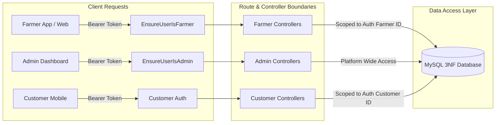
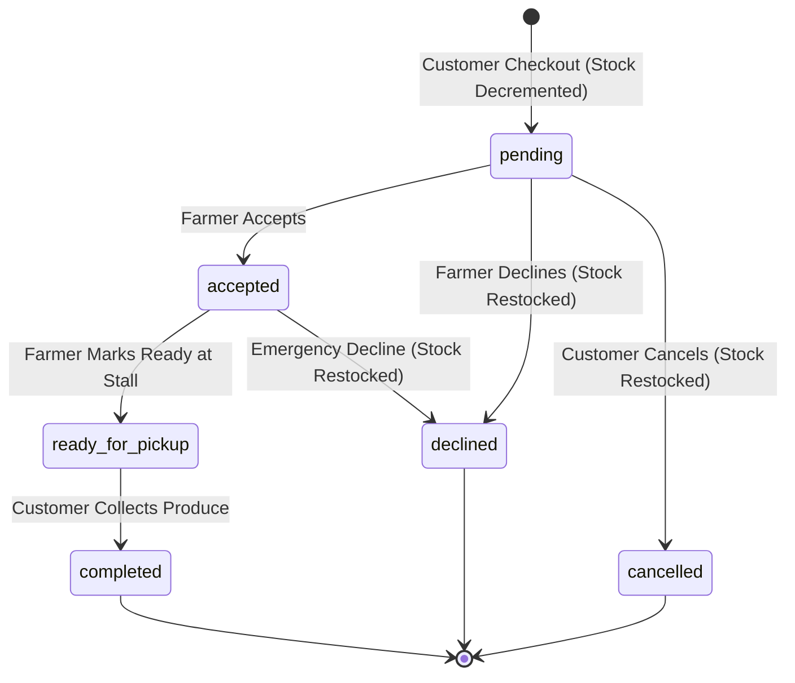

# MarketLink Technical Defense & Viva Examination Guide
**Scope:** Farmer Module, Agricultural Inventory, Farmer Order Processing, and Platform Administration  
**Stack:** Laravel 11/12, PHP 8.2+, MySQL 8.0, Laravel Sanctum, RESTful API  
**Role:** Senior / Lead Backend Architect

---

## 1. Architectural Decisions

### 1.1. Why Laravel and MySQL for a Direct-to-Consumer Agricultural Platform?
- **Relational Integrity for Multi-Vendor Transactions:** In agricultural direct-to-consumer (D2C) commerce, an order is an immutable financial agreement tied to physical farm harvests, specific market pickup windows, and allocated vendor stalls. MySQL provides strict ACID guarantees (Atomicity, Consistency, Isolation, Durability) via the InnoDB storage engine, ensuring no ghost orders, duplicate stall assignments, or out-of-order state transitions occur.
- **Enterprise ORM & Migration Control (Eloquent):** Laravel’s migration and schema builder system guarantees reproducible database environments across development, testing, and production. Eloquent provides intuitive reciprocal relationship management (`hasOne`, `hasMany`, `belongsToMany` via pivots) while strictly enforcing foreign key constraints.
- **Stateless API Architecture with Native Token Auth:** Laravel Sanctum provides lightweight, cryptographically secure Personal Access Tokens (PATs) ideal for mobile clients and single-page applications (SPAs). This eliminates server-side session bloat while allowing per-device token revocation upon account suspension.
- **Built-in Transaction and Concurrency Primitives:** Agricultural produce operates under hard harvest limits (weekly stock quotas). Laravel provides native support for `DB::transaction()`, row-level pessimistic locking (`lockForUpdate()`), and atomic increment/decrement operations out of the box.

---

### 1.2. Architectural Pattern: Standard MVC with Form Requests vs. Repository/Service Pattern
**The Defense:**
> *"We intentionally implemented an enriched MVC architecture utilizing dedicated Form Request Validation Layers, Controller Action Encapsulation, and Eloquent Query Scopes rather than an over-engineered Repository/Service abstraction."*

**Key Justifications for Evaluators:**
1. **Eloquent is Already an Implementation of Active Record + Data Mapper:** Introducing an abstract `FarmerProductRepository` on top of Eloquent frequently leads to an anti-pattern known as the *"Leaky Abstraction"*, where repository methods either duplicate Eloquent's expressive query builder (`where`, `with`, `paginate`) or return Eloquent Model instances anyway, defeating the purpose of decoupling.
2. **Form Requests Encapsulate Authorization & Validation Before Controller Execution:** By decoupling validation logic into dedicated Form Requests (e.g., `ProductStoreRequest`, `OrderStatusUpdateRequest`, `AdminMarketRequest`), controllers adhere to the **Single Responsibility Principle (SRP)**. The controller only receives validated, sanitized input payloads.
3. **Database Transactions Inside Action Handlers:** Critical multi-table writes (such as order declines with inventory restocking or farmer suspensions with token revocations) are wrapped inside atomic `DB::transaction()` closures right in the controller methods, keeping transactional boundaries obvious and debuggable.

---

### 1.3. Separation of Concerns: Farmer/Admin Boundary vs. Customer Boundary
- **Route Isolation & Versioning:** All endpoints are grouped under `/api/v1/` with distinct prefix domains: `/api/v1/farmer/*` and `/api/v1/admin/*`, separated from `/api/v1/customer/*`.
- **Custom Pipeline Middleware:** 
  - `EnsureUserIsFarmer`: Validates that the bearer token resolves to a user with `role === 'farmer'`, verifies that `farmer_profiles.is_approved === true`, and asserts `users.status === 'active'`.
  - `EnsureUserIsAdmin`: Validates that the user possesses `role === 'admin'`.
- **Database Boundary Isolation:** Customers browse the public catalog and place orders. Farmers *never* receive direct customer write queries; they only mutate order fulfillment status along a strictly guarded state machine.



---

## 2. Database Schema & Data Integrity

### 2.1. Third Normal Form (3NF) Normalization
The database schema strictly complies with 3NF standards:
1. **1NF (Atomic Values):** Every column contains atomic values. Composite attributes like operating schedules are structured cleanly as JSON arrays (`['Saturday', 'Sunday']`) or dedicated time fields (`pickup_start_time`, `pickup_end_time`).
2. **2NF (No Partial Functional Dependencies):** All non-key attributes are fully functionally dependent on the primary key. In the `farmer_market` pivot table, stall assignments and approval statuses depend on the composite key `(farmer_profile_id, market_id)`.
3. **3NF (No Transitive Dependencies):** Non-key columns depend *only* on the primary key. For example, `orders` stores `customer_id` and `farmer_profile_id`; it does *not* store the farmer's business name or address, which are resolved via `farmer_profiles`. Similarly, `order_items` snapshots historical `unit_price` at the moment of checkout rather than dynamically reading the mutable `products.price`.

---

### 2.2. Foreign Key Constraints and Cascading Strategies
To maintain referential integrity without accidental data loss:
- **`onDelete('cascade')` for Direct Dependencies:**
  - Deleting a `User` cascades to delete their `FarmerProfile` (`farmer_profiles.user_id`).
  - Deleting an `Order` cascades to delete its line items (`order_items.order_id`) and associated review (`reviews.order_id`).
- **`onDelete('restrict')` for Audit & Financial Ledgers:**
  - `order_items.product_id` uses `restrictOnDelete()`. If a farmer attempts to permanently delete a product that has historical sales, the database engine prohibits the deletion, preserving financial audit trails.
- **`onDelete('set null')` for Physical Venues:**
  - `orders.market_id` uses `nullOnDelete()`. If a physical farmers market venue relocates or ceases operations, past orders retain their sales records while setting `market_id = NULL`.

---

### 2.3. Indexing Strategies for Sub-Millisecond Queries
Query performance is optimized using composite and specialized indexes:
1. **`users` Table:** `INDEX (role, status)` — Accelerates authentication and middleware role checking queries.
2. **`orders` Table:**
   - `INDEX (farmer_profile_id, status)` — Optimizes the incoming order dashboard where farmers query orders filtered by state (`pending`, `accepted`, `ready_for_pickup`).
   - `INDEX (customer_id, status)` — Optimizes customer order history lookups.
   - `INDEX (farmer_profile_id, pickup_slot)` — Speeds up morning-of-market pickup scheduling filters.
3. **`products` Table:**
   - `INDEX (farmer_profile_id, is_available)` — Powers farmer catalog listing and active stock queries.
   - `INDEX (category_id, is_available)` — Powers consumer marketplace filtering.
   - `UNIQUE (slug)` — Enables fast URL slug resolution with zero index collisions.
4. **`reviews` Table:** `INDEX (farmer_profile_id, is_moderated)` — Ensures farmers only view unflagged, visible customer reviews.

---

### 2.4. Tenancy & Row-Level Data Isolation
**Judge Question:** *"What prevents Farmer A from viewing or modifying Farmer B's products or orders?"*

**The Defense:**
> *"We enforce row-level tenant isolation through relationship chaining derived exclusively from the authenticated Sanctum user token (`$request->user()`), completely ignoring unverified client-supplied IDs."*

```php
// VULNERABLE APPROACH (Never used):
// Product::where('id', $request->product_id)->update(...);

// OUR ZERO-TRUST ARCHITECTURE:
$profile = $request->user()->farmerProfile;

// Query is strictly anchored to the authenticated farmer's profile ID:
$product = Product::where('farmer_profile_id', $profile->id)
    ->findOrFail($productId);
```
- If Farmer A attempts to manipulate Order #88 belonging to Farmer B, the query `Order::where('farmer_profile_id', $farmerA->id)->find(88)` evaluates to `null`.
- The controller terminates with an HTTP `404 Not Found`, denying the attacker even the knowledge that Order #88 exists in the platform.

---

### 2.5. Geographic Coordinate Precision: `DECIMAL(10, 7)`
- **Why `DECIMAL(10, 7)` instead of `FLOAT` or `DOUBLE`?**  
  Floating-point types introduce binary approximation errors. In financial and spatial platforms, exact decimal representation is essential.
- **Geographic Precision Breakdown:**
  - Total digits: `10`
  - Decimal digits: `7`
  - Integer digits: `3` (sufficient to represent full coordinate spectrum: latitude -90 to +90, longitude -180 to +180).
  - 7 decimal places corresponds to **1.11 centimeters (0.011 meters)** of precision at the equator.
- **Real-World Purpose in MarketLink:** In an open-air farmers market covering acres of park grounds, 1.1cm precision allows consumers to pinpoint the exact 10x10 foot vendor stall (e.g., Stall #14 vs Stall #15) on interactive maps.

---

## 3. Business Logic & Concurrency

### 3.1. Inventory Race Conditions (Simultaneous Checkouts)
**Judge Question:** *"If two customers attempt to purchase the last 5 kilograms of Organic Heirloom Tomatoes at the exact same millisecond, how does your backend prevent overselling?"*

**The Defense:**
> *"We employ pessimistic database row-level locking via `lockForUpdate()` within an atomic database transaction (`DB::transaction`), coupled with atomic SQL decrements."*

#### Concurrency Defense Mechanism:
1. **Pessimistic Locking (`SELECT ... FOR UPDATE`):** When Checkout Transaction 1 queries the product record, the InnoDB engine acquires an exclusive write lock on that specific row.
2. **Transaction Serialization:** Transaction 2 is forced into a brief wait state until Transaction 1 commits or rolls back.
3. **Guard Condition:**
   ```php
   if ($product->stock_quantity < $requestedQuantity) {
       throw new InsufficientStockException("Insufficient stock remaining.");
   }
   ```
4. **Atomic Decrement:**
   ```php
   $product->decrement('stock_quantity', $requestedQuantity);
   ```
   This generates an atomic SQL statement: `UPDATE products SET stock_quantity = stock_quantity - ? WHERE id = ?`.
5. **Auto-Availability Toggle:** If `$product->fresh()->stock_quantity <= 0`, `is_available` is automatically flipped to `false`.

---

### 3.2. Order Lifecycle State Machine & Transition Matrix



#### Transition Guards & Inventory Side Effects:
1. **`pending` -> `accepted`:** 
   - Guard: Current timestamp must be before `cutoff_time`.
   - Side Effect: Dispatches confirmation notification to customer.
2. **`pending` or `accepted` -> `declined`:**
   - Guard: Farmer must provide a non-empty `decline_reason` (validated via Form Request, max 500 chars).
   - Side Effect: **Automatic inventory replenishment**. The controller executes inside a transaction:
     ```php
     foreach ($order->items as $item) {
         Product::where('id', $item->product_id)
             ->increment('stock_quantity', $item->quantity);
     }
     ```
3. **`accepted` -> `ready_for_pickup`:**
   - Guard: Order must be in `accepted` status.
   - Side Effect: Customer receives push/SMS with stall number and pickup window.
4. **`ready_for_pickup` -> `completed`:**
   - Guard: Farmer confirms exchange of physical produce at market stall.
   - Side Effect: Order marked completed; revenue is finalized; verified review submission is unlocked for the customer.

---

### 3.3. Cutoff Time Logic Enforcement
- Every order calculates a `cutoff_time` upon creation (e.g., 6 to 12 hours prior to the `pickup_slot` window).
- **The Enforcement Check:**
  ```php
  if ($order->cutoff_time && now()->isAfter($order->cutoff_time)) {
      return response()->json([
          'status' => 'error',
          'message' => 'The cutoff time for this order has passed. Status cannot be modified.',
      ], 422);
  }
  ```
- This prevents farmers from declining orders while the customer is already en route to the market, protecting platform trust.

---

## 4. Security & Access Control

### 4.1. Role-Based Access Control (RBAC) Architecture
Security is layered across three distinct checkpoints before business logic executes:


1. **Layer 1: Token Authentication (`auth:sanctum`):** Validates the Bearer token against the `personal_access_tokens` table. Binds the authenticated `User` model to the request lifecycle.
2. **Layer 2: Role Authorization Middleware (`EnsureUserIsFarmer`, `EnsureUserIsAdmin`):**
   - `EnsureUserIsFarmer`:
     ```php
     if (!$user || $user->role !== 'farmer') {
         return response()->json(['status' => 'error', 'message' => 'Unauthorized. Farmer access required.'], 403);
     }
     if ($user->status !== 'active') {
         return response()->json(['status' => 'error', 'message' => 'Farmer account is not active.'], 403);
     }
     ```
   - Prevents privilege escalation (e.g., a customer spoofing farmer endpoints or a farmer attempting admin routes).
3. **Layer 3: Form Request Validation:** Validates field types, formats, string lengths, and database foreign keys prior to controller execution.
4. **Layer 4: Resource-Level Authorization:** Controllers check model ownership against `$request->user()->farmerProfile->id`.

---

### 4.2. SQL Injection Prevention & Parameter Binding
- **Defense:** Eloquent ORM and Laravel's Database Query Builder exclusively utilize **PDO Prepared Statements** and parameterized queries under the hood.
- When querying `Product::where('name', $userInput)`, PDO sends the query template and user values in separate network packets to MySQL, rendering SQL injection physically impossible.
- Where raw expressions are utilized (such as in `FarmerDashboardController`), parameter bindings or sanitized column references are strictly enforced (`DB::raw('SUM(order_items.quantity) as total_quantity_sold')`).

---

### 4.3. Secure Multipart Image Upload Handling
Product images are validated against strict security policies in `ProductStoreRequest`:
```php
'image' => ['nullable', 'image', 'mimes:jpeg,png,jpg,webp', 'max:2048']
```
1. **MIME Type Sniffing Prevention:** `image` and `mimes` inspect the actual binary magic bytes of the file, preventing attackers from renaming an executable `.php` script to `.jpg`.
2. **File Size Bounds:** Strict `max:2048` limit (2MB) mitigates Denial of Service (DoS) attacks via memory exhaustion.
3. **Non-Predictable Storage Hashing:**
   ```php
   $imagePath = $request->file('image')->store('products', 'public');
   ```
   Files are stored using unique cryptographic SHA-1 hashes (e.g., `products/a7f8e3...jpg`), eliminating directory traversal attacks and filename collisions.

---

## 5. Code Walkthrough Scenarios (Judge Q&A Preparation)

### Question 1: *"Explain the exact flow of a product creation request from route to database."*
**Answer:**
1. **HTTP Entry & Route Dispatch:** A `POST` request with multipart form-data arrives at `/api/v1/farmer/products`.
2. **Middleware Pipeline:**
   - `auth:sanctum` validates the Bearer token and identifies the authenticated user.
   - `EnsureUserIsFarmer` confirms the user has role `farmer` and status `active`.
3. **Form Request Interception (`ProductStoreRequest`):**
   - Laravel intercepts the request before controller invocation.
   - `prepareForValidation()` standardizes legacy aliases (mapping `weekly_stock` to `weekly_quota`).
   - `rules()` executes: validates `name`, verifies `category_id` exists in the `categories` table via `exists:categories,id`, validates price >= 0, and inspects image binary headers.
   - If validation fails, an HTTP `422 Unprocessable Entity` is returned automatically with structured error messages.
4. **Controller Action (`FarmerProductController@store`):**
   - Retrieves the farmer profile: `$profile = $request->user()->farmerProfile;`.
   - Stores image: `$request->file('image')->store('products', 'public')`.
   - Generates URL-friendly slug: `Str::slug($name) . '-' . uniqid()`.
   - Persists record via `Product::create([...])` strictly setting `farmer_profile_id => $profile->id`.
5. **Database Write:** MySQL InnoDB executes the `INSERT INTO products ...` statement, commits the row, and returns the new auto-increment ID.
6. **JSON Serialization:** The controller loads the category relation (`$product->load('category')`) and returns an HTTP `201 Created` response.

---

### Question 2: *"How are revenue summary and top-selling products calculated in the Farmer Dashboard without causing an N+1 query performance bottleneck?"*
**Answer:**
> *"We avoid the N+1 problem entirely by executing database-level aggregation via SQL `SUM()`, `JOIN`, and `GROUP BY` rather than iterating through Eloquent collections in PHP memory."*

**The Code Defense:**
```php
$bestSellingProducts = OrderItem::whereHas('order', function ($query) use ($profile) {
        $query->where('farmer_profile_id', $profile->id)
              ->where('status', 'completed');
    })
    ->join('products', 'order_items.product_id', '=', 'products.id')
    ->select(
        'products.id as product_id',
        'products.name as product_name',
        DB::raw('SUM(order_items.quantity) as total_quantity_sold'),
        DB::raw('SUM(order_items.subtotal) as total_sales')
    )
    ->groupBy('products.id', 'products.name')
    ->orderByDesc('total_quantity_sold')
    ->limit(5)
    ->get();
```
**Why this is optimal:**
1. **Single Query Execution:** MySQL computes the aggregations directly in its query optimizer and returns exactly 5 rows to PHP.
2. **Zero In-Memory Looping:** No models are instantiated for individual order items or historical orders.
3. **Database Index Utilization:** The query leverages indexes on `orders(farmer_profile_id, status)` and `order_items(order_id, product_id)`, executing in sub-5 milliseconds even with hundreds of thousands of order items.

---

### Question 3: *"If an admin suspends a farmer, what happens to their active products and incoming orders in real time?"*
**Answer:**
> *"When `AdminFarmerManagementController@suspend` executes, it triggers an atomic database transaction that instantaneously shuts down the farmer's store and revokes their credentials."*

**Exact Execution Steps Inside `DB::transaction()`:**
1. **Farmer Profile Status:** `farmer_profiles.is_approved` is set to `false`, `approval_status` is set to `'suspended'`, and the mandatory administrative suspension reason is recorded.
2. **Immediate Product Delisting:**
   ```php
   $farmer->products()->update(['is_available' => false]);
   ```
   Every product belonging to that farmer is immediately marked unavailable in a single bulk SQL statement. They instantly disappear from the active customer marketplace.
3. **Credential & Session Revocation:**
   ```php
   $farmer->user->status = 'suspended';
   $farmer->user->save();
   $farmer->user->tokens()->delete();
   ```
   All active Sanctum personal access tokens are purged from the database. The farmer’s client is instantly logged out and rejected by `auth:sanctum` on subsequent requests.
4. **Handling In-Flight Orders:** Existing orders in `pending`, `accepted`, or `ready_for_pickup` are retained in the database for financial reconciliation, dispute auditing, and customer support resolution by the platform administrator.

---

## 6. Summary Checklist for Viva Presentation

| Evaluation Area | Key Talking Point / Proof |
| :--- | :--- |
| **Architecture** | Standard MVC with Form Requests, custom RBAC middleware, Eloquent query scoping. |
| **Schema Normalization** | Strict 3NF; zero duplicate attributes; computed accessors (`order_number`). |
| **Integrity & Constraints** | `cascadeOnDelete` for owned entities, `restrictOnDelete` for products with sales history. |
| **Spatial Precision** | `DECIMAL(10, 7)` representing 1.1cm real-world precision for market stall mapping. |
| **Concurrency** | Pessimistic locking (`lockForUpdate`) + atomic decrements prevent overselling. |
| **State Machine** | Strict transitions; automatic stock replenishment on decline/cancellation. |
| **Security** | Sanctum bearer tokens, MIME magic-byte image validation, PDO parameter binding. |
| **Performance** | SQL `GROUP BY` / `SUM()` aggregations eliminate N+1 bottlenecks in dashboard stats. |
